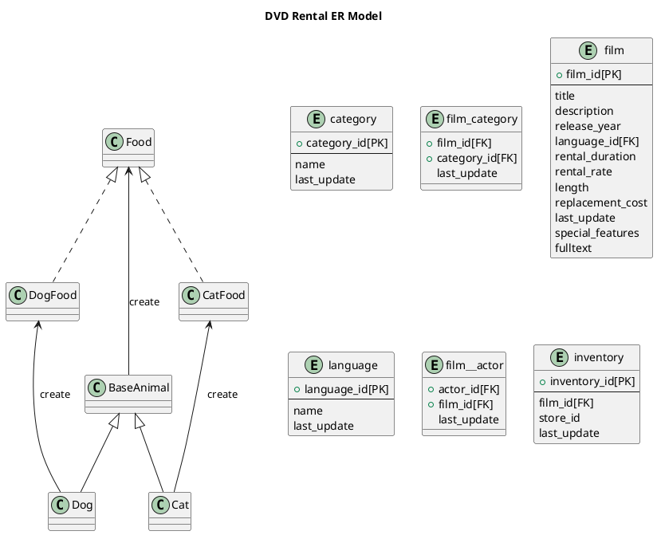

# DVD Rental ER Model

```plantuml
@startuml
title DVD Rental ER Model

entity "category" as category {
    +category_id[PK]
    --
    name
    last_update
}

entity "film_category" as film_category {
    +film_id[FK]
    +category_id[FK]
    last_update
}

entity "film" as film {
    +film_id[PK]
    --
    title
    description
    release_year
    language_id[FK]
    rental_duration
    rental_rate
    length
    replacement_cost
    last_update
    special_features
    fulltext
}

entity "language" as language {
    +language_id[PK]
    --
    name
    last_update
}

entity "film＿actor" as film＿actor {
    +actor_id[FK]
    +film_id[FK]
    last_update
}

entity "inventory" as inventory {
    +inventory_id[PK]
    --
    film_id[FK]
    store_id
    last_update
}

Food <|. DogFood
Food <|. CatFood

BaseAnimal <|-- Dog
BaseAnimal <|-- Cat

Food <-- BaseAnimal:create
DogFood <-- Dog:create
CatFood <-- Cat:create


@enduml
```
